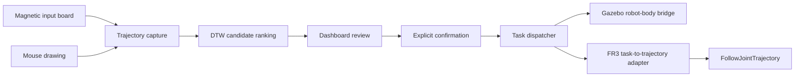

# Magnetic Trajectory Robot Interface

> Public portfolio edition. Attribution, provenance, hardware-validation boundaries, and third-party license notices are retained below.

Magnetic Trajectory Robot Interface is a dual-mode ROS1 robot interaction system. `TASK` converts magnetic-board or mouse trajectories into ranked DTW candidates and keeps explicit confirmation between recognition and execution. `TELEOP` provides continuous Cartesian manual control through a shared damped-least-squares inverse-kinematics core.

## Architecture at a glance



Recognition never sends motion directly. Candidate display, confirmation, dispatch, and backend execution remain separate boundaries.

## Control modes

| Backend | `TASK` | `TELEOP` |
| --- | --- | --- |
| Gazebo | Recognition-driven task execution | Keyboard Cartesian control |
| Real FR3 | Discrete task execution | Magnetic-board Cartesian teleoperation |

`TASK` is the fail-closed startup mode. The dashboard can request `TASK` or
`TELEOP`, but GUI mode selection is not hardware authorization: it does not
start Gazebo, open serial, connect an FR3, load a controller, approve
calibration, or enable physical commands.

The continuous Gazebo path was runtime validated with keyboard Cartesian input,
the shared `Fr3CartesianTeleopCore`, the simulated trajectory controller, and a
moving Gazebo Panda. The Real-FR3 Cartesian and discrete adapters were compiled
and integrated, but physical Real-FR3 TELEOP runtime was not executed. See
[Dual-Mode Teleoperation](docs/DUAL_MODE_TELEOPERATION.md).

## What the system does

- Captures 2D trajectories from a serial magnetic board or a mouse-driven dashboard.
- Uses a tracked DTW template bank to rank the symbols `1,2,3,V,O,X,A,C`.
- Presents ranked candidates and requires an explicit `C Confirm` action.
- Maps confirmed labels to a bounded task vocabulary in the dispatcher.
- Routes accepted tasks to a Gazebo Panda robot-body bridge or an FR3-compatible `FollowJointTrajectory` adapter.
- Switches between supervised `TASK` ownership and continuous Cartesian `TELEOP` ownership without treating mode selection as a hardware gate.
- Packages Gazebo and FR3 environments in separate Docker profiles.

## Key technical contributions

- Profile-aware Board/Mouse interaction with a magnetic-orientation clutch for transfer suppression.
- ROS-free DTW feature and template-bank helpers integrated into the recognizer node.
- A single dashboard for drawing, ranked-candidate review, dwell feedback, and explicit confirmation.
- A dispatcher boundary that prevents recognition output from becoming motion without confirmation.
- Separate Gazebo and FR3 execution adapters with conservative defaults and validation gates.
- A shared C++ Cartesian core for keyboard-driven Gazebo development and magnetic-board Real-FR3 integration.
- Docker build-time provenance labels plus static, unit, route-isolation, and safety tests.

## System architecture

The data path is:

```text
Board or Mouse
  -> trajectory sample
  -> DTW ranked candidates
  -> dashboard review
  -> explicit confirmed label
  -> dispatcher task command
  -> Gazebo bridge OR FR3 trajectory adapter
```

See [Architecture](docs/ARCHITECTURE.md) for component ownership, topics, and backend separation. Internal ROS identifiers retain the original `colmag` namespace for compatibility.

## Board and Mouse interaction profiles

| Concern | Board profile | Mouse profile |
| --- | --- | --- |
| Draw | Orientation clutch plus drawing zone | Mouse stroke in dashboard |
| Recognize | Explicit `B Recognize` | Automatic after stroke release |
| Confirm | Explicit `C Confirm` | Explicit `C Confirm` |
| Clear | `X Clear` | `X Clear` |
| Transfer suppression | Clutch disengagement | Not required |

The Board profile separates cursor navigation from recorded drawing so movement between the drawing area and controls does not contaminate the sample. See [Interaction Profiles](docs/INTERACTION_PROFILES.md).

## Recognition and explicit confirmation

The recognizer normalizes a completed trajectory, compares it with the tracked DTW bank, and publishes ranked candidates on `/colmag/symbol_candidates`. The dashboard may publish a selected label on `/colmag/confirmed_label` only after explicit confirmation. The dispatcher is the sole owner of `/colmag/task_command`; candidate display alone cannot execute a task.

The tracked bank was generated from user-handwritten mouse seeds and retains per-template provenance fields. It is included in this public portfolio edition with those provenance fields preserved.

## Gazebo and FR3 backends

- **Gazebo TASK:** a simulation-only bridge creates bounded Panda joint trajectories and uses a `FollowJointTrajectory` action interface.
- **Gazebo TELEOP:** normalized keyboard Cartesian input passes through the shared `Fr3CartesianTeleopCore` and publishes bounded controller `JointTrajectory` commands.
- **Real FR3 TASK:** a C++ task-to-trajectory adapter validates accepted discrete commands and constructs bounded trajectories for a standard controller path.
- **Real FR3 TELEOP:** continuous magnetic-board position passes through the same Cartesian core and a separately gated controller adapter.

Repository tests start none of these runtime surfaces. Real hardware remains disabled until all environment, revision, network, controller, calibration, and physical safety gates pass. See [Hardware Boundaries](docs/HARDWARE_BOUNDARIES.md).

## Technology stack

| Layer | Technology |
| --- | --- |
| Middleware | ROS1 Noetic, catkin, `rospy`, `roscpp` |
| Recognition | Python, DTW, JSON template bank |
| Interface | Tk-based dashboard and ROS topics |
| Simulation | Gazebo, Panda model, `control_msgs/FollowJointTrajectory` |
| Hardware interface | C++, `franka_ros`, `libfranka`, joint trajectory controller |
| Packaging | Docker, Docker Compose, OCI revision labels |
| Validation | pytest, XML/static checks, ROS-free C++ safety tests |

## Repository structure

```text
colmag_ros/          ROS package, dashboard, recognizer, dispatcher, FR3 adapter
colmag_gazebo_stub/ Gazebo robot-body bridge package
docker/             Gazebo and FR3 build/runtime profiles
scripts/            Offline DTW and guarded FR3 operator helpers
src/serial_mvp/     Serial packet parser and source abstraction
tests/              Static, unit, route-isolation, and safety checks
docs/               Portfolio architecture, run, validation, and boundary docs
```

Legacy compatibility-sensitive module, launch, configuration, and test filenames are retained where renaming would risk breaking imports, install rules, or route contracts. They are not used as reader-facing milestones.

## Quick Start

Run the repository test suite without creating a pytest cache:

```bash
python3 -m pytest -p no:cacheprovider -q
```

Build the Mouse-to-Gazebo profile from the current revision:

```bash
COLMAG_GIT_SHA="$(git rev-parse HEAD)" \
docker compose -f docker/compose.yaml \
  --profile mouse-gazebo build mouse-gazebo
```

Start the simulation profile only when GUI and Gazebo runtime are authorized:

```bash
docker/run_gazebo_demo.sh mouse-gazebo
```

The FR3 profiles are intentionally excluded from the quick path. See [Running](docs/RUNNING.md) before using any serial, simulation, or hardware surface.

## Validation

The public portfolio edition is checked for:

- Python/static/unit contracts and ROS-free C++ safety helpers;
- Markdown and image-link closure with case-sensitive paths;
- Docker `COPY` sources and Compose references;
- ROS package manifests and launch includes;
- secrets, private network values, personal absolute paths, and identity-bearing files;
- nontechnical process packaging and misleading sole-authorship wording.

Exact results for this revision are recorded in [Validation](docs/VALIDATION.md).

## Known limitations

- This is a research/demo stack, not a certified robot product.
- DTW quality depends on trajectory quality and template coverage.
- The Board orientation clutch is an application convention, not a safety-rated sensor mode.
- Static and unit tests do not prove live ROS timing, rendered GUI behavior, Gazebo motion, or physical FR3 safety.
- Gazebo Cartesian TELEOP has runtime evidence; physical Real-FR3 Cartesian TELEOP does not.
- The FR3 route depends on specific upstream versions and must be requalified when the environment changes.
- Public availability does not change the authorship, attribution, or third-party license boundaries documented in `CREDITS.md` and `NOTICE.md`.

## My contribution

The contribution wording below is supported by the fixed branch history, source ownership map, implementation files, and recorded validation evidence.

| Area | Contribution |
| --- | --- |
| Interaction design | Designed and implemented the Board interaction clutch and the distinct Board/Mouse profiles. |
| Recognition integration | Implemented and integrated the DTW template-bank path, ranking gates, tracked bank, and evaluation tooling. |
| UI/dashboard | Implemented, refactored, and validated the shared dashboard, candidate display, dwell state, and explicit confirmation flow. |
| Execution integration | Integrated the dispatcher, Gazebo robot-body bridge, and FR3 task-to-trajectory adapter while preserving supervised execution boundaries. |
| Dual-mode teleoperation | Implemented and integrated `TASK`/`TELEOP` ownership, keyboard Cartesian Gazebo control, magnetic-board Real-FR3 integration, and the shared Cartesian core. |
| Docker/testing | Implemented Docker packaging and maintained static, unit, route-isolation, and safety validation. |
| Documentation | Authored and maintained architecture, operator, safety, and validation documentation for the fixed branch. |

These claims do not assert sole authorship of the original collaborative project or ownership of upstream ROS, Gazebo, Franka, or other third-party components.

## Attribution and provenance

This repository is a public personal portfolio edition derived from a collaborative robotics project. It focuses on the components I designed, integrated, validated, and documented. Collaborative and third-party contributions remain credited in [CREDITS.md](CREDITS.md) and applicable notices in [NOTICE.md](NOTICE.md).

The portfolio baseline was exported as a filtered tracked snapshot from source commit `e3c81fb31f5113c50f197bb11eff183295cf3163`. This revision adds the subsequently developed and validated dual-mode Cartesian teleoperation working-tree changes as a curated file export. The original Git history, branches, tags, internal process records, private evidence, and nontechnical materials were not copied.

## License and status

**Public portfolio edition.**

This repository does not add a repository-wide license beyond the license information already present in retained source/package metadata. Public availability does not alter third-party ownership or upstream license obligations. See [NOTICE.md](NOTICE.md) for provenance and dependency-license boundaries.
