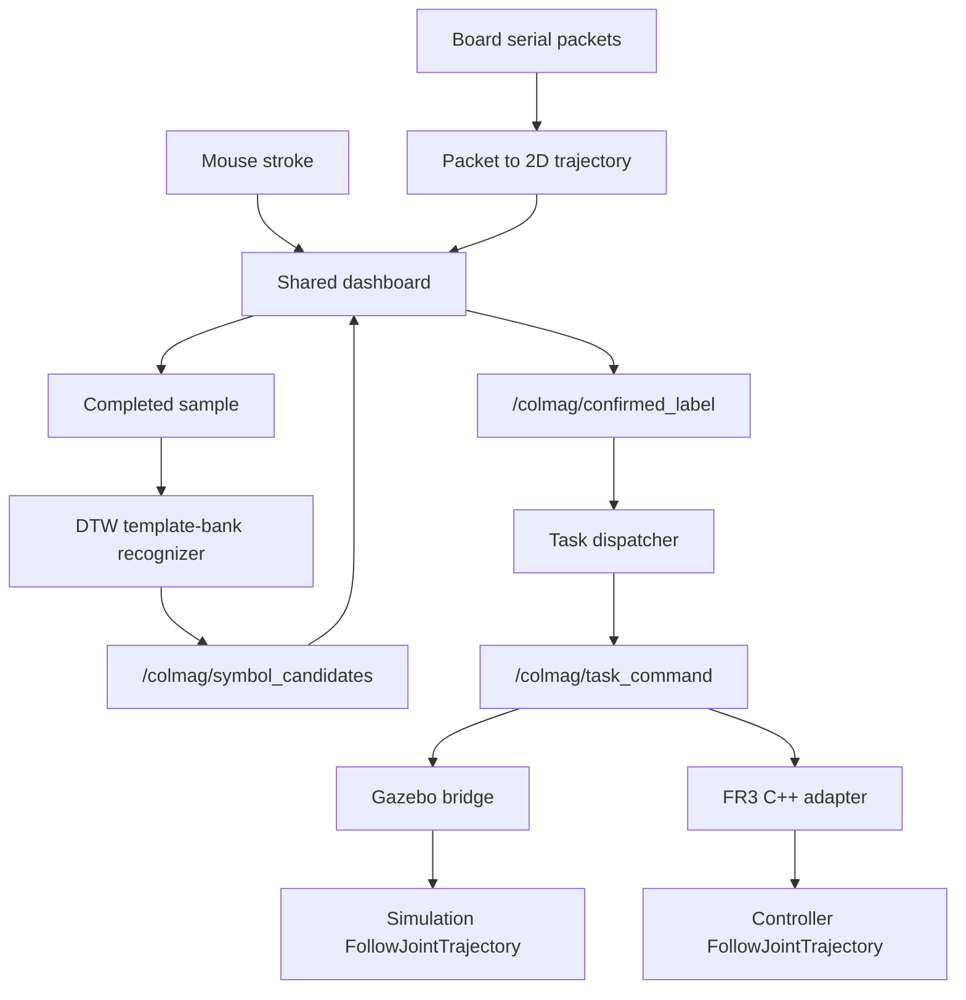

# Architecture

## Supervised control path

The system has four distinct decision boundaries:

1. trajectory completion;
2. recognition and candidate ranking;
3. explicit human confirmation;
4. dispatcher acceptance and backend routing.

No recognizer component owns `/colmag/task_command`.

## Dual-mode ownership

The latched `/colmag/control_mode` state has exactly two values: `TASK` and
`TELEOP`. `TASK` admits the supervised recognition/confirmation/dispatch route.
`TELEOP` blocks new task dispatch and admits the continuous Cartesian adapter.
Mode selection and backend/hardware authorization are independent.

| Backend | `TASK` | `TELEOP` |
| --- | --- | --- |
| Gazebo | DTW confirmation to task bridge | Keyboard input to shared Cartesian core |
| Real FR3 | Discrete FR3 task adapter | Magnetic-board input to shared Cartesian core |

See [Dual-Mode Teleoperation](DUAL_MODE_TELEOPERATION.md) for routes, ownership
transitions, validation evidence, and the physical-runtime boundary.

## Component ownership

| Responsibility | Primary implementation |
| --- | --- |
| Board packet conversion | `colmag_ros/scripts/raw_packet_to_trajectory_2d_node.py` |
| Shared Board/Mouse dashboard | `colmag_ros/scripts/magnetic_trajectory_dashboard_node.py` |
| Interaction geometry and clutch | `colmag_ros/src/colmag_ros/dashboard_geometry.py` |
| Candidate presentation | `colmag_ros/src/colmag_ros/dashboard_candidate_display.py` |
| Confirmation payload | `colmag_ros/src/colmag_ros/dashboard_confirm_publisher.py` |
| DTW ranking | `colmag_ros/scripts/trajectory_symbol_top3_recognizer_node.py` |
| Dispatcher | `colmag_ros/scripts/task_dispatcher_node.py` |
| Control-mode source | `colmag_ros/scripts/control_mode_node.py` |
| Cartesian input | `colmag_ros/scripts/keyboard_cartesian_teleop_node.py` |
| Shared Cartesian core | `colmag_ros/src/fr3_cartesian_teleop_core.cpp` |
| Cartesian adapter | `colmag_ros/src/colmag_fr3_cartesian_teleop_adapter.cpp` |
| Gazebo robot-body bridge | `colmag_gazebo_stub/scripts/fr3_gazebo_visible_task_bridge_node.py` |
| FR3 adapter | `colmag_ros/src/colmag_fr3_task_trajectory_adapter.cpp` |
| Runtime packaging | `docker/` |

## Frontend profiles

The neutral frontend aliases are `dtw_mouse_demo_frontend.launch` and `dtw_real_board_demo_frontend.launch`. They share recognizer and dashboard code but differ in sample completion and interaction behavior. GUI-only use can disable confirmed-label publication and omit dispatcher/backend components.

## Recognition

The tracked bank uses schema `colmag_dtw_template_bank.v1`. Each template stores label, normalized trajectory data, and provenance fields such as source type, source file identifier, source backend, and y-flip state. Ranking uses DTW distance plus confidence and margin gates.

## Execution separation

Gazebo and FR3 are separate backends:

- Gazebo receives accepted tasks through a simulation-only bridge and rejects real-robot control claims.
- FR3 receives accepted tasks through a C++ adapter with freshness, deduplication, limits, lifecycle ownership, and final-state checks.

The same task name does not imply the same safety qualification across simulation and hardware.

## Compatibility

The `colmag` namespace, several launch filenames, configuration paths, and module names are retained because they form implemented API and packaging contracts. Reader-facing branding is neutral; no broad runtime namespace rename was attempted.
